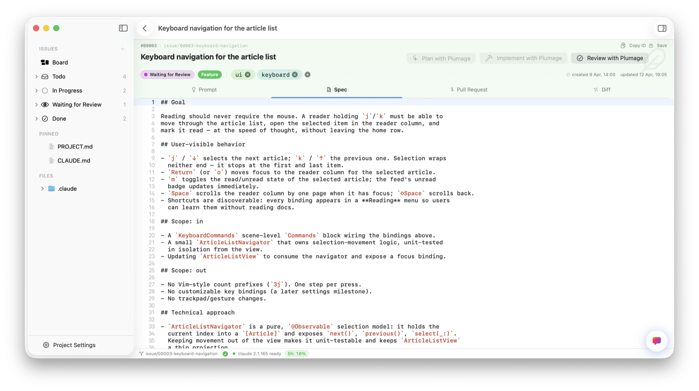
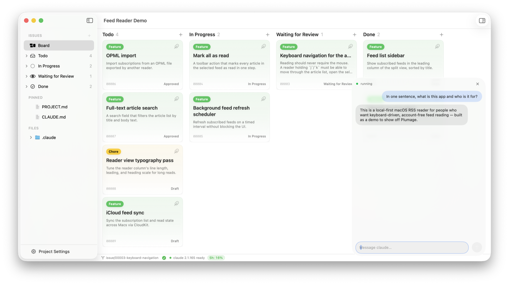
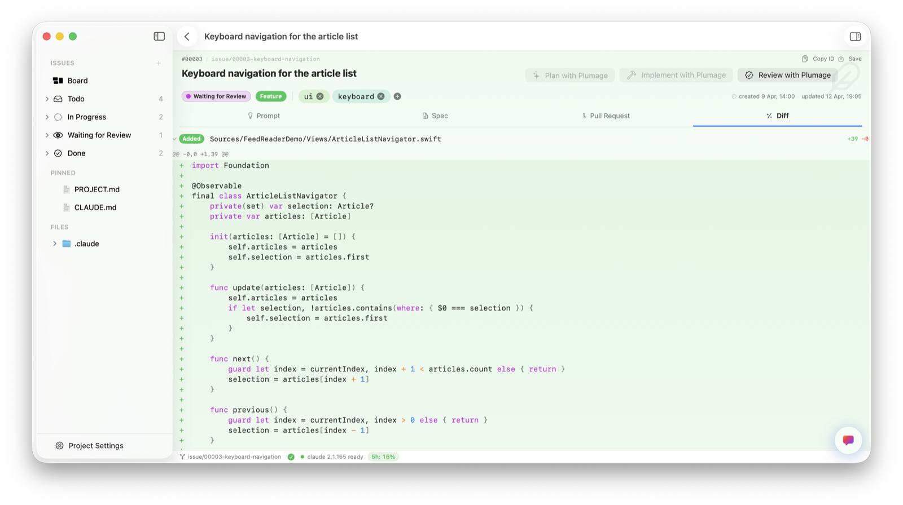

# Plumage

**A native macOS desktop wrapper for the [Claude Code](https://claude.com/claude-code)
CLI.** The `claude` binary runs as an embedded subprocess; Plumage layers a Kanban
board over your issues, a spec editor, an embedded agent (chat *and* terminal), and
a local pull-request review on top — turning a raw terminal workflow into something
you can see, steer, and review.

[](LICENSE)


> [!IMPORTANT]
> **Plumage is experimental, and it's a learning project first.** I built it mainly
> to *learn* Claude Code — to get hands-on with its agentic, spec-driven workflows
> by actually living inside them in a real, non-trivial macOS app, rather than just
> reading about them. It happens to be useful, but it's a personal learning project
> first and a tool second. You're welcome to use it, fork it, or take ideas from it,
> but it ships with **no support, no roadmap promises, and no stability guarantees**.
> Expect rough edges.

## Why I built this

Claude Code's workflow lives in a raw terminal: issues are markdown files you write
by hand, runs are progress you track in your head, and PRs are diffs you scroll
through in `git`. That works — but a lot of the structure stays invisible, and the
only way I really learn a tool is by building something non-trivial with it.

So Plumage is two things at once: a way to **learn Claude Code by building around
it**, and a small attempt to make its workflow tangible — specs with a frontmatter
lifecycle, a Kanban board over what was previously just a folder, an agent you can
talk to right next to your work, and reviewable `PR.md` artifacts instead of
trust-the-agent commits. The point is **not** to replace the CLI; the CLI is still
where the work happens. Plumage is the scaffolding around it.

## Who it's for

Plumage is built for **Swift and Apple-platform developers first**, on a **Claude
Pro/Max subscription**. The bundled project templates (SwiftUI apps, server-side
Swift, Swift CLIs), the code snippets, the `swift-format` / SwiftLint pre-commit
gates, the auto-installed Xcode tooling and the in-app build/run integration all
assume a Swift project. Other project types *are* supported through additional
templates in the Template Manager — Swift is simply where Plumage is sharpest.

## Features

### Kanban board over `.claude/issues/`

Your issues, grouped by status. Drag-and-drop between columns writes straight back
to each spec's frontmatter — the file system stays the source of truth, Plumage is
just a view onto it.


### Structured specs with an in-app editor

Every issue is a markdown spec with a typed frontmatter lifecycle
(`draft → approved → in-progress → waiting-for-review → done`). Read and edit
specs, `PR.md` and project docs in-app, with syntax highlighting and live
external-change detection.



### Embedded Claude — chat

A floating "Claude dock" runs a real `claude` session scoped to the open project,
so you can ask questions and drive work without leaving the window.



### Embedded Claude — terminal

The same agent in a full terminal, right inside the project window — run Claude
Code interactively (or any command) without switching apps.


### Local pull-request & diff review

Review the diff and the generated `PR.md` side by side, then merge or reject — all
against local `git`. No GitHub token, no API, nothing leaves your machine.



### Project & template manager

Manage the project templates, shared components, docs, hooks, agents and skills
that get scaffolded into new projects — the Swift-first catalog, plus anything else
you add.


## What makes it different

- **Subscription-compliant by design.** Every Claude interaction goes through the
  `claude` CLI as a subprocess — no API key, no SDK, no `messages.create`. Plumage
  runs on your existing Claude Pro/Max subscription.
- **File system is the source of truth.** Issues, specs, `PR.md`, configs and run
  state are plain files under `.claude/` and `.plumage/`. No database, no cloud, no
  sync — what's on disk is what survives a crash.
- **Local-first review.** The PR view runs entirely against local `git`; ad-hoc
  commit / push / pull is available, but nothing requires a GitHub token.
- **Opinionated per-project setup.** On create, Plumage pins the right MCP servers
  (e.g. XcodeBuildMCP), recommends compatible plugins (Axiom for Apple platforms),
  and templates platform-specific snippets into `CLAUDE.md` and the workflow skills.

## The daily loop

Plumage is built around one dominant flow, in order:

1. **Open a project** → the Kanban board shows current issues, grouped by status.
2. **Plan an issue** → `/plumage-plan <slug>` interviews you in plan-mode, writes
   the spec, and sets its status to `approved`.
3. **Implement** → `/plumage-implement <slug>` runs the spec's tasks, commits per
   task behind a pre-commit gate, writes a `PR.md`, and sets status to
   `waiting-for-review`.
4. **Review** → open the `PR.md` and the diff, decide merge or reject.
5. **Merge locally** → status moves to `done`; the branch becomes history.

## Requirements

- **macOS 26** or later.
- **Xcode 26** (Swift 6, strict concurrency) to build.
- The **`claude` CLI** installed and on your `PATH` (Plumage shells out to it; it
  does not bundle or replace it), signed in to a Claude Pro/Max subscription.

## Building

```sh
git clone <your-fork-url> Plumage
cd Plumage
open Plumage.xcodeproj
```

Then build and run the `Plumage` scheme (⌘R). There is **no Swift Package and no
external build step** — Plumage is a single Xcode target with folder-based modules;
dependencies are resolved by Xcode via SwiftPM.

A few things to know before you build your own copy:

- **Set your own signing team.** The project currently hard-codes a
  `DEVELOPMENT_TEAM` (`F6A5PBNZF2`). Change it to your own in *Signing &
  Capabilities*, or override it locally, before building a signed copy.
- **It is not sandboxed — on purpose.** Plumage spawns `claude`, `git` and
  `swift-format` as subprocesses, which the App Sandbox would block. Mac App Store
  distribution is intentionally out of scope; direct download + notarization only.
- **Forking to ship?** The app and its document types use the
  `com.benjaminhuebner.plumage.*` reverse-DNS prefix (in `Info.plist` and a few
  Swift `UTType` declarations). If you publish your own build, change that prefix to
  your own so it doesn't clash with the original on macOS.

## Built with

Plumage is a SwiftUI app with no runtime backend — it orchestrates local tools
(`claude`, `git`, `swift-format`) as subprocesses. Its third-party dependencies,
resolved via Swift Package Manager:

- **[Sparkle](https://github.com/sparkle-project/Sparkle)** — in-app software updates.
- **[SwiftTerm](https://github.com/migueldeicaza/SwiftTerm)** — the embedded terminal.
- **[CodeEditorView](https://github.com/mchakravarty/CodeEditorView)** — the integrated code & spec editor (pulls in [Rearrange](https://github.com/ChimeHQ/Rearrange)).
- **[Yams](https://github.com/jpsim/Yams)** — YAML parsing for issue-spec frontmatter.

Everything else is Apple frameworks (SwiftUI, AppKit bridges, Liquid Glass).

## Architecture

Single Xcode target, organized by folder-based modules rather than separate
framework targets. The app is SwiftUI with the MV (`@Observable`) pattern, Liquid
Glass on the navigation layer, and AppKit bridges where macOS needs them (window
chrome, the embedded terminal). One hard boundary: everything that touches Claude
Code internals lives in `ClaudeCodeIntegration/`, enforced by a CI grep test.

## License

[MIT](LICENSE) © 2026 Benjamin Hübner
