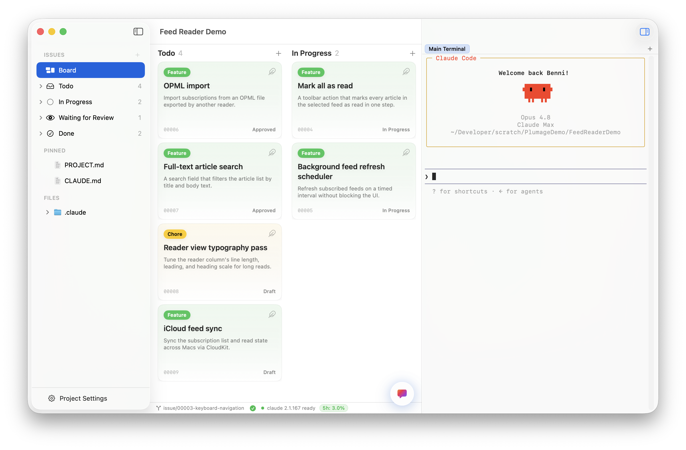
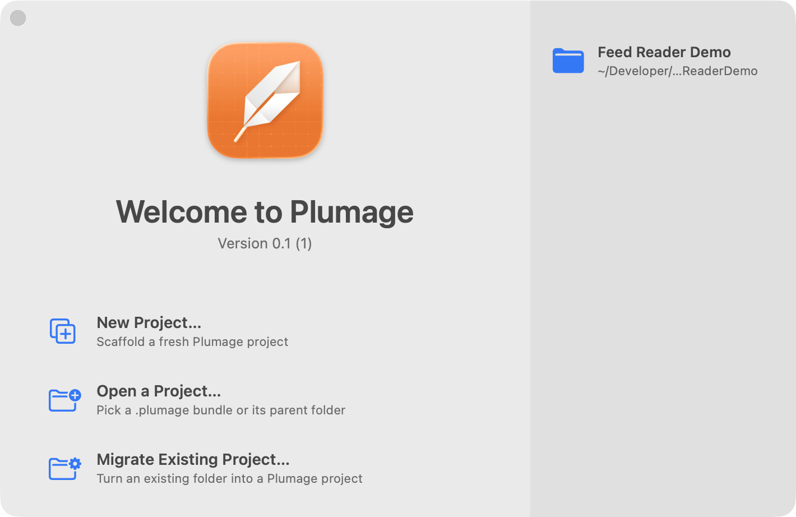
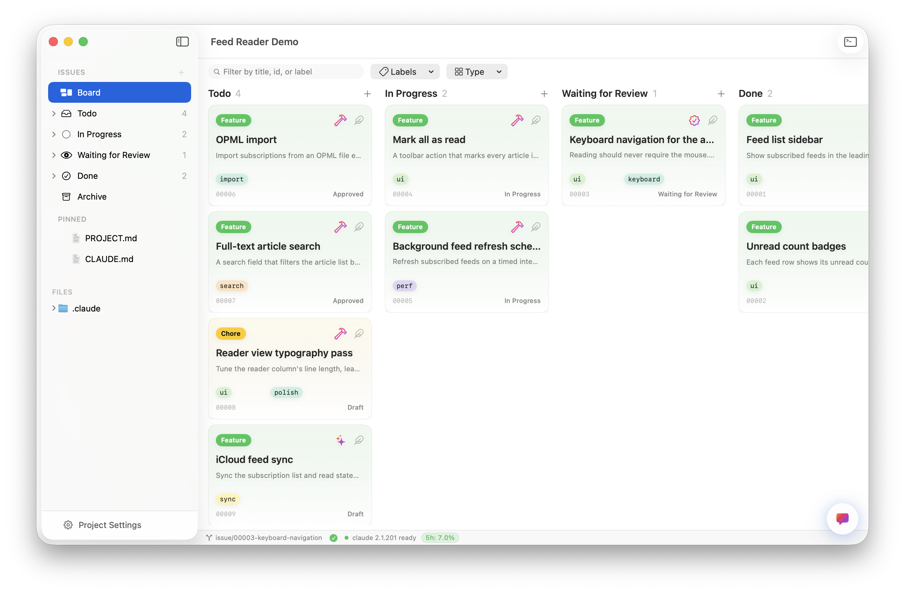
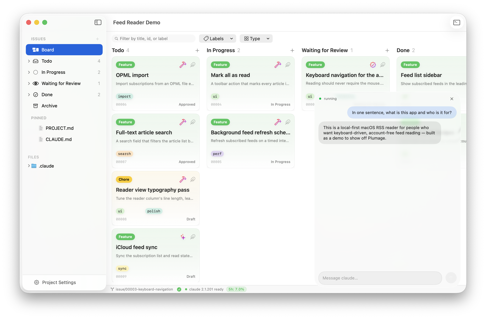
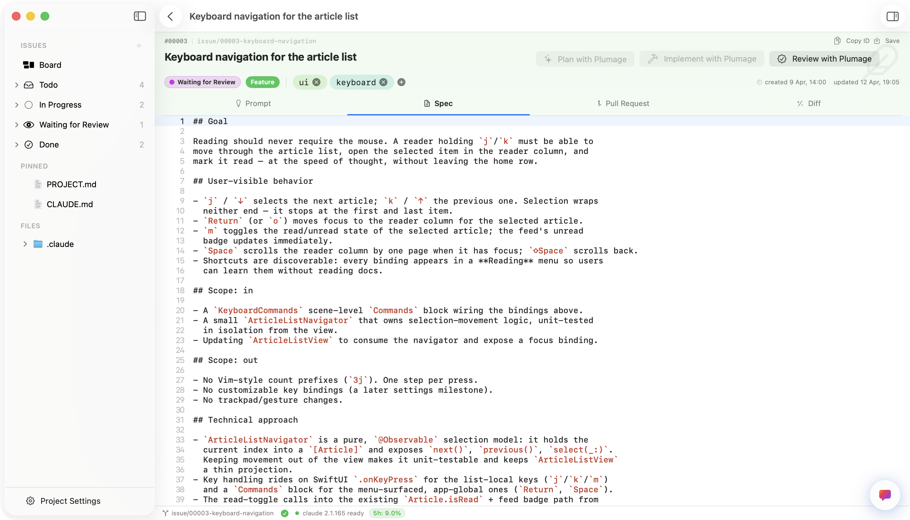
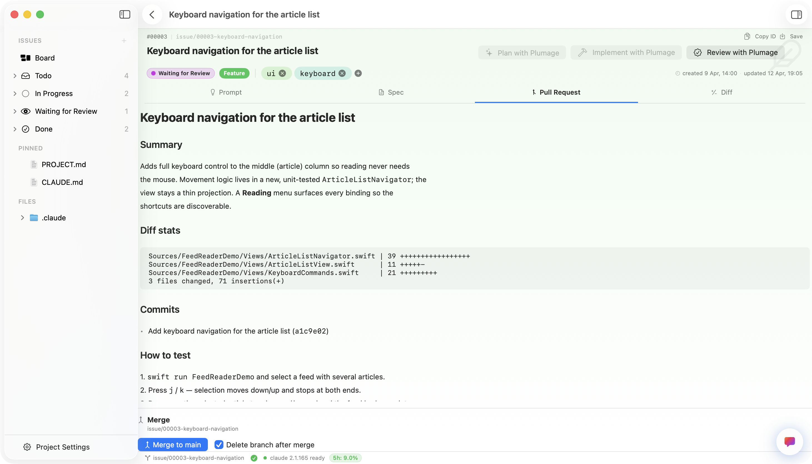
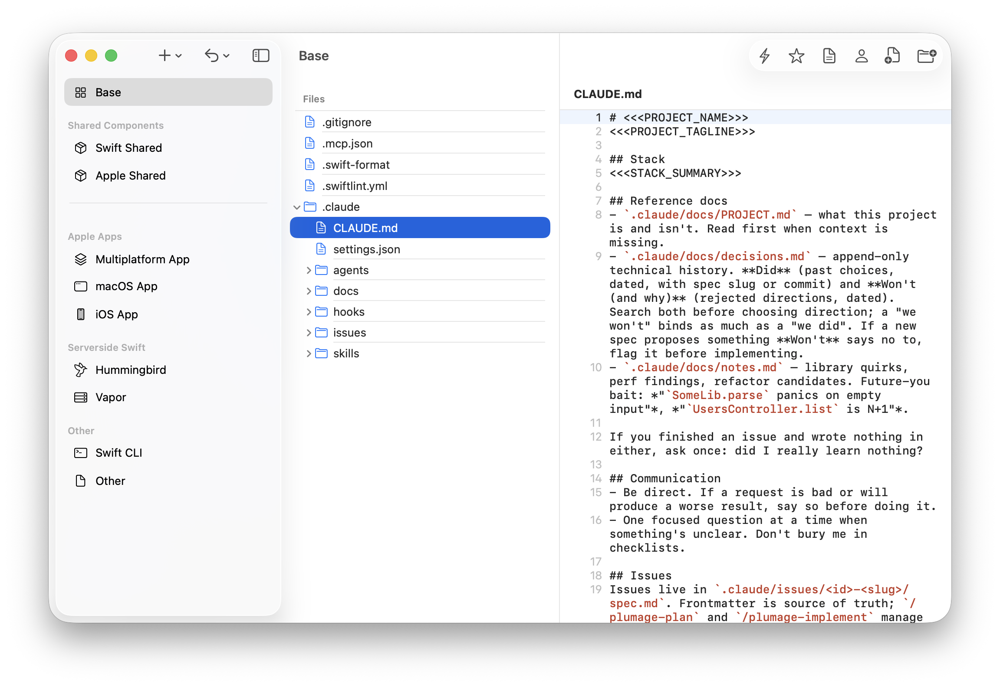
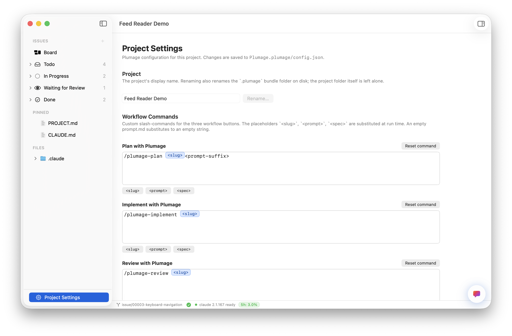
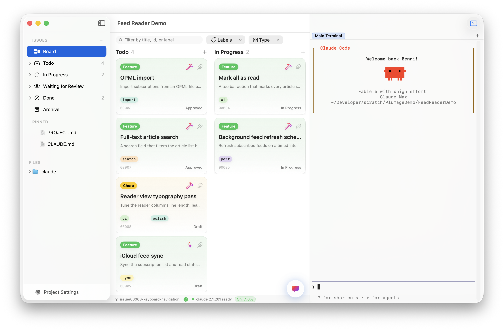

<picture>
  <source media="(prefers-color-scheme: dark)" srcset="Docs/title-dark.png">
  
</picture>

**A native macOS workspace for [Claude Code](https://claude.com/claude-code) workflows.**

   

*Issues, specs, an embedded agent, and local PR review — the spec-driven loop you'd otherwise run blind in a terminal, given a real UI you can see, steer, and review.*

> [!IMPORTANT]
> **Plumage is experimental, and a learning project first.** I built it mainly to
> *learn* Claude Code — to get hands-on with a spec-driven workflow by
> living inside it in a real macOS app instead of just reading about it.
> It turned out useful, but it's a personal learning project first and a tool second.
> You're welcome to use it, fork it, or take ideas from it, but it ships with **no
> support, no roadmap promises, and no stability guarantees.** Expect rough edges.

---

## Contents

- [About](#about)
- [Who it's for](#who-its-for)
- [Features](#features)
- [Embedded workflow](#the-embedded-workflow)
- [Requirements](#requirements)
- [Built with](#built-with)
- [License](#license)

---

## About

Plumage integrates the Claude Code CLI: the `claude` binary runs as a subprocess,
and almost every interaction flows through it. But Plumage is far more than a
terminal front-end — it turns the entire spec-driven workflow into a native macOS
workspace, with a Kanban board for your issues, an integrated spec editor, the
agent docked right next to your work (as both a chat and a full terminal), and
local pull-request review.

It's meant to *support* the CLI, not replace it. The goal is simply to automate the
workflow and make it easier to see and steer.

## Who it's for

Plumage wraps a Claude Code workflow aimed primarily at Swift developers. The
boundaries are kept deliberately loose, though: you can add your own templates and
workflows to suit how you work. Nothing ties it to Swift or to any one skill set —
that's just what it has been tested with.

## Features

<table>
  <tr>
    <td width="50%" valign="top">
      
      
<strong>Welcome window</strong> Reopen a recent project, scaffold a fresh one, or turn an existing folder into a Plumage project.

    </td>
    <td width="50%" valign="top">
      
      
<strong>Kanban board over <code>.claude/issues/</code></strong> Your issues, grouped by status. Drag a card between columns and the move writes straight back to each spec's frontmatter — the file system stays the source of truth.

    </td>
  </tr>
  <tr>
    <td width="50%" valign="top">
      
      
<strong>Embedded Claude — chat dock</strong> A floating dock runs a real <code>claude</code> session scoped to the open project, so you can ask questions and drive work without leaving the window.

    </td>
    <td width="50%" valign="top">
      
      
<strong>Structured spec editor</strong> Every issue is a Markdown spec with a typed frontmatter lifecycle (<code>draft → approved → in-progress → waiting-for-review → done</code>), edited in-app with syntax highlighting and live external-change detection.

    </td>
  </tr>
  <tr>
    <td width="50%" valign="top">
      
      
<strong>Local pull-request review</strong> Read the generated <code>PR.md</code> — summary, diff stats, commits, test notes — then merge or reject against local <code>git</code>. No GitHub token, no API, nothing leaves your machine.

    </td>
    <td width="50%" valign="top">
      
      
<strong>Template manager</strong> Manage the templates, shared components, docs, hooks, agents, and skills scaffolded into new projects — the Swift-first catalog, plus anything else you add.

    </td>
  </tr>
  <tr>
    <td width="50%" valign="top">
      
      
<strong>Per-project settings</strong> Customize the workflow slash-commands and, per action, the permission mode, model, and effort level passed to <code>claude</code>. Saved to <code>&lt;name&gt;.plumage/config.json</code>.

    </td>
    <td width="50%" valign="top">
      
      
<strong>Embedded Claude — terminal</strong> The same agent in a full terminal, docked right inside the project window — run Claude Code interactively (or any command) without leaving the app.

    </td>
  </tr>
</table>

## Embedded workflow

Plumage ships an opinionated, spec-driven workflow built right into the UI, instead
of leaving it to you to remember. Every issue carries three workflow actions — **Plan**,
**Implement**, and **Review** — surfaced as buttons on the issue itself. Each one runs a
slash-command in an embedded `claude` session scoped to that issue, and each advances the
spec's status along a typed lifecycle: `draft → approved → in-progress →
waiting-for-review → done`.

The default workflow is fully integrated into the app, but it’s not rigid. If you prefer a different process, you can customize the workflow directly within Plumage.

The commands are defaults, not hardcoded. `/plumage-plan`, `/plumage-implement`, and
`/plumage-review` — along with the permission mode, model, and effort level passed to `claude`
for each — are fully customizable per project and saved to `<name>.plumage/config.json`. Point
them at your own slash-commands and Plumage drives those instead.

A typical pass through it:

1. **Plan** → `/plumage-plan <slug> - <prompt>` interviews you in plan-mode, writes the spec, and
   sets its status to `approved`.
2. **Implement** → `/plumage-implement <slug>` works through the spec's tasks, commits per
   task behind a pre-commit gate, writes a `PR.md`, and moves the status to
   `waiting-for-review`.
3. **Review** → open the generated `PR.md` and the diff, then merge or reject against local
   `git`. On merge, the status moves to `done` and the branch becomes history.

## Requirements

- **macOS 26** or later.
- The **`claude` CLI** installed and on your `PATH` (Plumage shells out to it — it
  does not bundle or replace it), signed in to a Claude Pro/Max subscription.

## Built with

Plumage is a SwiftUI app with no runtime backend — it orchestrates local tools
(`claude`, `git`, `swift-format`) as subprocesses. Its third-party dependencies,
resolved via Swift Package Manager:

| Dependency | What it's for |
| --- | --- |
| [Sparkle](https://github.com/sparkle-project/Sparkle) | In-app software updates |
| [SwiftTerm](https://github.com/migueldeicaza/SwiftTerm) | The embedded terminal |
| [CodeEditorView](https://github.com/mchakravarty/CodeEditorView) | The integrated code & spec editor (pulls in [Rearrange](https://github.com/ChimeHQ/Rearrange)) |
| [Yams](https://github.com/jpsim/Yams) | YAML parsing for issue-spec frontmatter |

Everything else is Apple frameworks (SwiftUI, AppKit bridges, Liquid Glass).

## License

[MIT](LICENSE) © 2026 Benjamin Hübner
